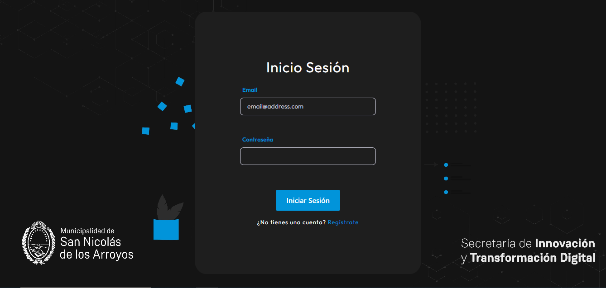

# Desafío técnico 

## Descripción

En este proyecto podemos gestionar la autenticación y registro de usuarios, proporcionando una interfaz fácil de usar y segura. Estas son sus funcionalidades principales:

__Registro de usuarios__:

En la pantalla de registro, los nuevos usuarios pueden ingresar sus detalles, como nombre, apellido, dirección de correo electrónico y contraseña.
Se implementan validaciones para garantizar la integridad de los datos ingresados.
Una vez completado el registro, el sistema almacena la información en la base de datos de manera segura.

__Inicio de sesión__:

La pantalla de inicio de sesión permite a los usuarios existentes ingresar sus credenciales para acceder al sistema.
Se realiza una verificación en el servidor, donde se consulta la base de datos para confirmar la autenticidad del usuario y la correspondencia de la contraseña.

__Redirección a la pantalla principal__:

Una vez que el inicio de sesión o el registro se completan con éxito, el sistema redirige automáticamente al usuario a la pantalla principal. La ruta principal del proyecto varía en función del tipo de usuario:

__Usuario regular__:
Si el usuario recién registrado o que ha iniciado sesión es un usuario regular, será redirigido a la ruta principal estándar del proyecto.

__Usuario administrador__:
En caso de que el usuario sea un administrador, la redirección llevará a una ruta principal específica diseñada para mostrar una tabla donde se encuentran todos los usuarios registrados con su respectiva información. 

## Instrucciones de instalación.

Instalación de dependencias del cliente:

Accede al directorio del cliente mediante el comando cd client.
Ejecuta npm install para instalar las dependencias necesarias. Este comando descargará e instalará todas las bibliotecas y paquetes requeridos para el cliente.

__cd client__

__npm install__

Instalación de dependencias del servidor:

Abre otra terminal o regresa al directorio principal del proyecto mediante el comando cd ... 
Accede al directorio del servidor con el comando cd server.
Ejecuta npm install para instalar las dependencias del servidor. Esto garantizará que todas las bibliotecas esenciales para la parte del servidor estén instaladas.

__cd server__

__npm install__

## Uso del proyecto.

Para poder usar este proyecto, necesitarás abrir dos terminales en Visual Studio Code:

__Servidor del cliente__:
Abre una terminal en Visual Studio Code y navega hasta el directorio del cliente usando el comando:

__cd client__

El proyecto en el frontend fue creado con Vite + React por lo tanto para iniciar el servidor del cliente debemos ejecutar el comando:

__npm run dev__

__Servidor del backend__:
Abre una segunda terminal en Visual Studio Code y navega hasta el directorio del servidor utilizando el comando:

__cd server__

Inicia el servidor del backend ejecutando el siguiente comando:

__node app.js__

Esto iniciará el servidor del backend y estará listo para manejar las solicitudes del cliente.

__Acceso a la Ruta del administrador__:

Para acceder a la ruta del administrador en este proyecto, utiliza las siguientes credenciales:

- **Email:** admin_snciudad@gmail.com
- **Contraseña:** SNciudad14

Estas credenciales te permitirán iniciar sesión como administrador y acceder a la tabla de usuarios registrados en la base de datos

## Endpoints

### `GET /api/`

- **Descripción:** Ruta principal del proyecto.
- **Acción:** Retorna un mensaje indicando que el servidor está en ejecución.

### `GET /api/users/allusers`

- **Descripción:** Obtiene la lista de todos los usuarios almacenados en la base de datos.
- **Acción:** Retorna un JSON con la información de todos los usuarios, incluyendo sus atributos como id_user, nombre, apellido, correo electrónico, contraseña y si son administradores.

### `POST /api/users`

- **Descripción:** Agrega un nuevo usuario a la base de datos.
- **Parámetros de entrada (en el cuerpo de la solicitud):**
  - `name` (String): Nombre del usuario.
  - `lastName` (String): Apellido del usuario.
  - `email` (String): Dirección de correo electrónico del usuario.
  - `password` (String): Contraseña del usuario.
  - `admin` (Boolean): Indica si el usuario es un administrador.
- **Acción:**
  - Verifica si el correo electrónico ya está registrado.
  - Crea un nuevo usuario en la base de datos.
  - Retorna la información del usuario recién creado en formato JSON.

### `POST /api/login`

- **Descripción:** Autentica a un usuario.
- **Parámetros de entrada (en el cuerpo de la solicitud):**
  - `email` (String): Dirección de correo electrónico del usuario.
  - `password` (String): Contraseña del usuario.
- **Acción:**
  - Verifica las credenciales proporcionadas.
  - Retorna un JSON con el resultado de la autenticación, indicando si fue exitosa, y si es un administrador.

### `POST /api/users/check-email`

- **Descripción:** Verifica si un correo electrónico ya está registrado en la base de datos.
- **Parámetros de entrada (en el cuerpo de la solicitud):**
  - `email` (String): Dirección de correo electrónico a verificar.
- **Acción:**
  - Retorna un JSON indicando si el correo electrónico ya está registrado (true) o no (false).

## Tecnologías y Herramientas Usadas

Este proyecto ha sido desarrollado utilizando las siguientes tecnologías:

- **React + Vite**

- **Sass**

- **Node.js**

- **Express**

- **MySQL**